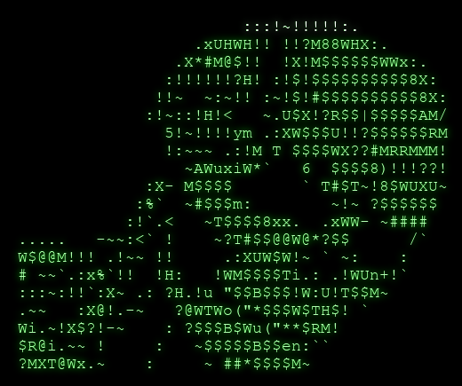
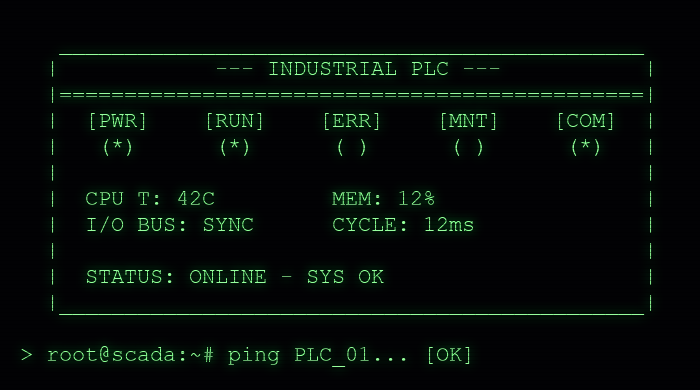
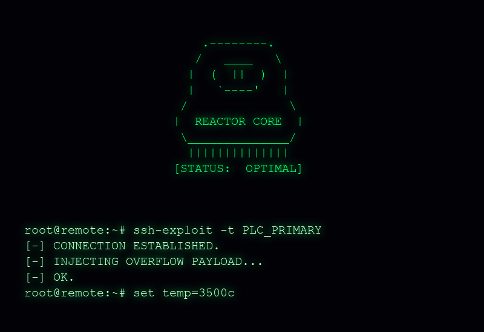

  

### [SYSTEM_IDENTIFICATION]
> ALIAS: z4y_d3n\
> DESIGNATION: OT/ICS Security Analyst & Firmware Developer\
> STATUS: ONLINE

The perimeter is an illusion. I specialize in auditing, pentesting, and exposing vulnerabilities within Industrial Control Systems (ICS) and Operational Technology (OT) networks. From deep protocol manipulation to the development of custom hardware implants, my objective is to demonstrate the fragility of critical infrastructure to ultimately forge more resilient systems.

---

### [CURRENT_DIRECTIVES]

  

 

Researching and developing standalone hardware instruments for industrial protocol auditing.

**DEPLOYED ARSENAL:**

* [**MODBUS TCP AUDITOR TOOL**](https://github.com/z4y-d3n/modbus-tcp-auditor-tool): Custom firmware developed specifically for the M5StickC Plus2. Designed for aggressive pentesting, packet manipulation, and auditing of Modbus TCP environments.

--- 

**PENDING DECLASSIFICATION & UPLOAD:**

* **S7COMM AUDITOR TOOL:** Tactical firmware for the M5StickC Plus2 engineered to audit and penetrate Siemens S7 (Classic) TCP architectures. Capabilities include L2 hardware spoofing, SZL fingerprinting, and direct manipulation of Data Blocks (DBs) and I/O memory surfaces.
* **FINS AUDITOR TOOL:** Specialized protocol-auditing firmware developed for the M5StickC Plus2, targeting Omron FINS TCP architectures.
* **Arsenal Fieldbus:** Hardware toolset utilizing ESP32 architecture for penetrating and analyzing industrial serial communications (RS485, CAN).
* **Tactical Hardware:** Designing custom Printed Circuit Boards (PCBs) and implementing RF lab tools (CC1101, RTL-SDR) for physical-layer audits.
* **ICS Honeypots & Simulators:** Python-based PLC simulators engineered for protocol auditing and exploit testing.

---

### [OPERATIONAL_IMPACT]

  

 

> "Security by obscurity is a failing strategy in the industrial sector. We break the logic to secure the core."